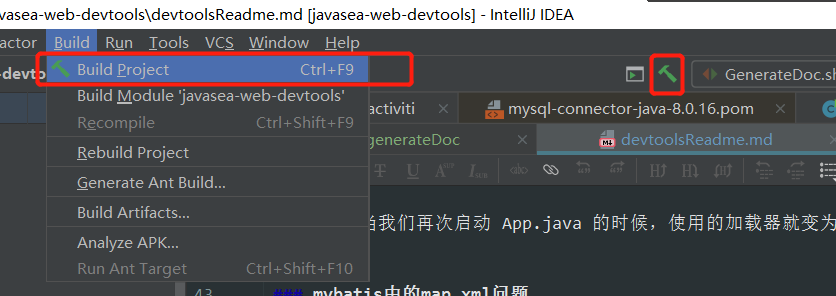

## <center>热部署</center>

操作方式：
敲代码后,点击菜单 build->build module

相关设置：
开启程序运行时编译


取消选中，否则可能每敲一个字符都会去编译


在需要编译的时候手动按ctrl+F9或者点击锤子即可



### 设置配置文件

application.properties或application.yml中禁用缓存

以下仅供参考，没有的就去掉，需要的就加上
```shell
spring.thymeleaf.cache=false
spring.freemarker.cache=false
spring.groovy.template.cache=false
spring.velocity.cache=false
```
参考：
https://www.cnblogs.com/TechSnail/p/7690829.html

### include 和 exclude
当配置了 devtools 后，我们在classpath修改任何文件项目都将会自动重启。

　　（1）某些资源在更改时不一定需要触发重新启动。例如, Thymeleaf 模板可以就地进行编辑。默认情况下更改资源路径包括了：/META-INF/maven, /META-INF/resources ,/resources ,/static ,/public 或者 /templates 不会触发重新启动, 但会触发实时重新加载。

如果逆向排除这些路径，可以使用如下配置：

　　spring.devtools.restart.exclude=static/**,public/**

　　（2）如果要保留这些默认值并添加其他排除项, 请使用 spring.devtools.restart.additional-exclude 属性代替。

　　（3）通过 System.setProperty("spring.devtools.restart.enabled", "false"); 方法，可以在SpringApplication.run()方法运行天使用关闭 devtools。

　　（4）当我们再次启动 App.java 的时候，使用的加载器就变为了 restartedMain 了，说明热部署已经成功。


### mybatis中的map.xml问题
   devtools 由于是双类加载机制，再结合了通用Mapper后可能会出现 java.lang.ClassCastException 异常(例如：说class x.x.A cannot be cast to x.x.A。)。

　　解决方案就如下：

　　在 src/main/resources 中创建 META-INF 目录，在此目录下添加 spring-devtools.properties 配置，内容如下：

　　restart.include.mapper=/mapper-[\\w-\\.]+jar
　　restart.include.pagehelper=/pagehelper-[\\w-\\.]+jar
参考： https://www.cnblogs.com/rcddup/p/7533125.html
