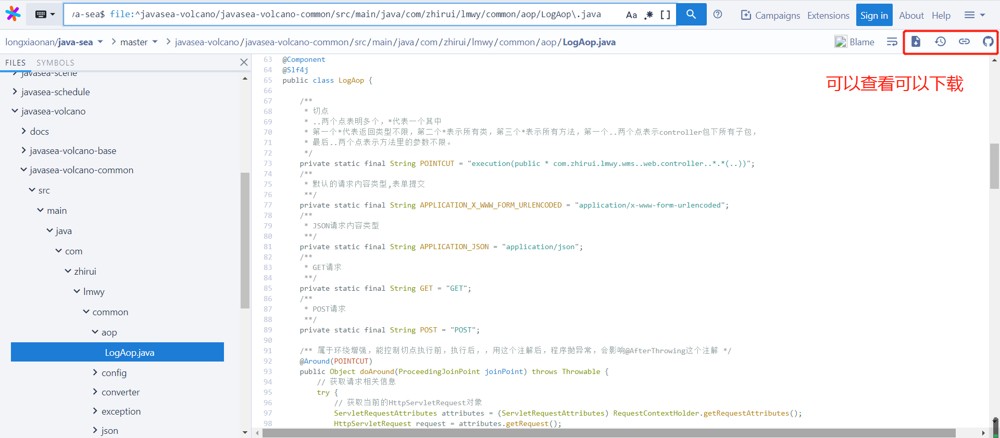
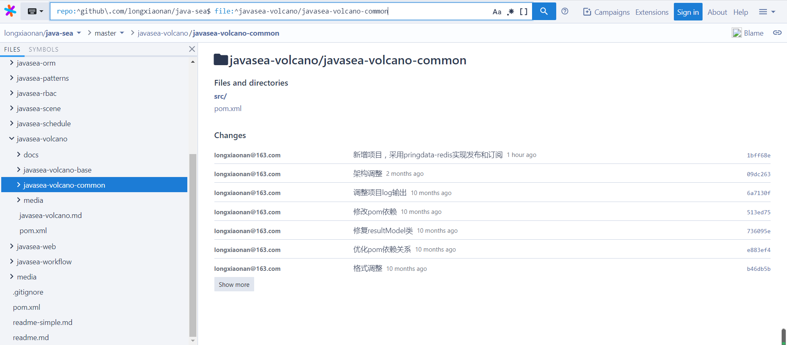
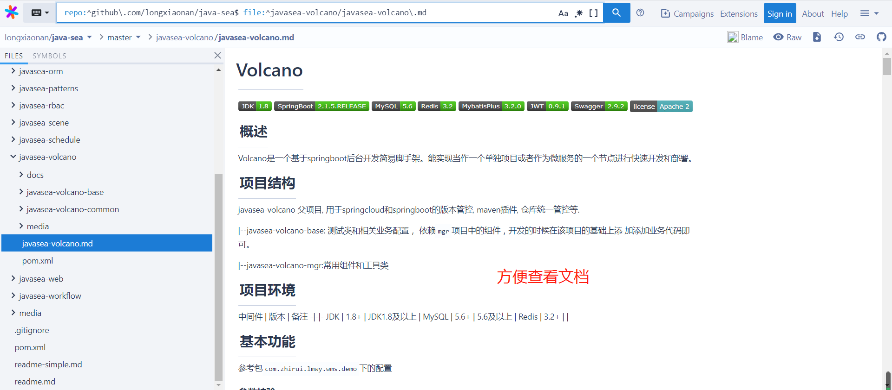

# JAVA SEA

## 概述

希望打造一个基于springboot的java全知识栈项目，都是总结好的代码，拿去即用，提高开发效率。因为整个`java`的知识体系很庞大，为了方便整理，所以一些设计到的知识点都整合到了该项目下，项目模块较多，每个知识点都是一个独立的项目（具体看pom的配置）， **请在IDE中单独打开子模块中的项目，直接打开`java-sea`项目会加载和编译较长时间**。还可以用`sourcegraph`插件查看相关代码后copy到直接本地进行调试。后期如果代码过大会考虑每个知识点独立成一个项目，该项目作为索引。

项目下很多知识点未完善，正在持续优化中。

Q：为什么都整合在一起，不觉得乱吗？

A：不整合的话，那么每个知识点一个项目，不知道需要几十个还是上百个项目，项目之间管理太乱了。

Q：为什么按照这种层级(项目目录结构)进行划分？

A：这个是按照我对基于springboot框架对整个java技术栈的理解来的，每个人理解不一样可能有些目录结构会比较奇怪。欢迎一起研究讨论。

Q：项目这么庞大臃肿编译岂不是会很卡？

A：整个项目其实大，不过每个子项目的demo都是可以直接运行的。我在本地打开整个`java-sea`项目也不会有这个问题，可能初次编译的时候和下载依赖需要些时间。

​	  项目最大的用途是用于参考，当需要某个需求的时候，我就会来找相关项目，如果有就直接调试和使用，如果没有就新增demo到项目。

​	 我使用了`sourcegraph`插件，该插件能够在线查看github项目，非常方便，gitee没了解相关插件。如果不是很必要，我都是`start`后直接用这个插件查看代码了，都不用去fuck和clone到本地。

	  

## 项目目录结构

子模块下是针对各个知识点的项目。各个模块下的项目无直接依赖。

### javasea-base

javase基础知识测试的demo，具有参考意义。当知识点忘记细节时找的相关目录执行下即可看到结果。

### javasea-cache

java缓存相关的项目， 在service层通过注解`@Cacheable`和`@CacheEvict`实现。

* **javasea-cache-ehcache**

  通过ehcache实现缓存

* **javasea-cache-redis**

  通过redis实现缓存

### javasea-file
> 头像是张良，他技能是放几本书（file）作为法阵，大招还是用线连着敌人定住人（io）

文件或者文档相关处理项目，基本IO流项目

* **javasea-file-archive**

  未完成的文件归档项目，计划是设计一个通用的文件归档中间件，将收集的数据，已对象或json的格式，归档到不同的数据库或者搜索引擎中。例如收集车辆车机的数据到mongodb，elasticsearch和mysql中。

* **javasea-file-download**

  实现文件下载的demo项目。

* **javasea-file-excel**

  实现excel操作的项目，还需要集成和整理如下功能：

  1. poi基本操作的demo
  2. 通过xml格式解析excel的demo
  3. 集成阿里的[easyexcel](<https://github.com/alibaba/easyexcel>)的demo
  4. 测试大数据量的excel导入
  5. 通用的报表导出功能。

- **javasea-file-upload**

  实现文件上传的demo项目。

### javasea-lot

物联网相关测试demo

- **javasea-lot-opc-utgard**

  opc的测试demo，opc虽然是比较旧的工业化控制技术，但是我也把它归属到了物联网中的一部分。

### javasea-mq

消息队列相关的项目

* **javasea-mq-rabbitmq**

  rabbitmq的基本测试

### javasea-nio

* **javasea-nio-netty**

  netty测试的demo，实现了netty服务端和客户端简单通信。

* **javasea-nio-netty2**

  收集github中的netty整合项目，据说能开箱即用，未测试。

### javasea-nosql

springboot整合nosql的项目项目集

* [**javasea-nosql-elasticsearch**](javasea-nosql/javasea-nosql-elasticsearch/readme/readme.md)

  springboot整合es项目。

* **javasea-nosql-mongodb**

  springboot整合mongodb项目

* [**javasea-nosql-redis-distributedlocks**](javasea-nosql/javasea-nosql-redis-distributedlocks/readme-redis-distributedlocks.md)

  redis实现分布式锁

* **javasea-nosql-redis-jedis**

  jedis方式实现redis

* [**javasea-nosql-redis-springdata**](javasea-nosql/javasea-nosql-redis-springdata/readme.md)

  基于springboot和springdata实现redis操作

* [**javasea-nosql-redis-subscription**](javasea-nosql/javasea-nosql-redis-subscription/readme-redis-subscription.md)

  通过redis实现消息订阅

### javasea-orm

springboot集成orm相关框架

* [**javasea-orm-mybatisgenerator-pomplugin**](javasea-orm/javasea-orm-mybatisgenerator-pomplugin/readme-mybatisgenerator.md)

  springboot集成mybatis，且通过pom插件的方式集成mybatis-generator代码生成器。

* [**javasea-orm-mybatisplus**](javasea-orm/javasea-orm-mybatisplus/readme-mybatisplus.md)

  [mybatis-plus](<https://mp.baomidou.com/>)是目前很火的一个mybatis的扩展，极大的简化了对ORM的操作，该项目集成了mybatis-plus，且提供了一些curd的相关示例。

* **javasea-orm-pagehelper**

  springboot集成github的分页插件。

* **javasea-orm-springdata-multidatasource**

  springboot实现多数据源测试demo。

### javasea-patterns

通过java实现的设计模式示例

* [**javasea-patterns-base**](javasea-patterns/javasea-patterns-base/readme-patterns-base.md)

  设计模式基本示例。

* [**javasea-patterns-example**](javasea-patterns/javasea-patterns-example/readme-patterns-example.md)

  收集的设计模式在实际项目使用的代码

### javasea-rbac

java后台的权限模块相关项目，如shiro，springdata，sso，oauth2等相关技术的demo。

* [**javasea-rbac-jwtsecurity**](javasea-rbac/javasea-rbac-jwtsecurity/readme-security.md)

  springboot集成spring-security和jwt

* [**javasea-rbac-jwtsecurity-sso**](javasea-rbac/javasea-rbac-jwtsecurity-sso/readme-jwtsecurity-sso.md)

  springboot集成spring-security，jwt和sso

* [**javasea-rbac-security**](javasea-rbac/javasea-rbac-security/readme.md)

  [imooc网的security课程](<https://coding.imooc.com/learn/list/134.html>)的代码实践

* [**javasea-rbac-shiro**](javasea-rbac/javasea-rbac-shiro/rabcShiroReadme.md)

  springboot整合shiro

### javasea-scene

在一些特定的场景下需要的一些功能

* [**javasea-scene-repeatsubmit**](javasea-scene/javasea-scene-repeatsubmit/readme-repeatsubmit.md)

  请求重复提交的场景，代码遗漏，需要补充

* [**javasea-scene-simplemail**](javasea-scene/javasea-scene-simplemail/readme-simplemail.md)

  邮件发送demo

### javasea-schedule

 任务调度相关项目，将整合quartz，XXL-Job, elastic-job

* [**javasea-schedule-quartz**](javasea-schedule/javasea-schedule-quartz/readme-schedule-quartz.md)

### [javasea-volcano](javasea-volcano/javasea-volcano.md)

该项目是基于springboot和SSM后台的开发脚手架，已经整合了工具类，通过mybatis-plus实现ORM操作。定义了异常出来，参数校验等示例。

* **javasea-volcano-base**

  脚手架项目测试的demo，使用该脚手架时，参考该demo配置即可。

* **javasea-volcano-common**

  脚手架项目的common项目，整合了工具类，swagger等常用工具。

### javasea-web

基于springboot和spring在web开发时常用的一些功能

* **javasea-web-aspect**

  面向切面编程AOP测试等

* **javasea-web-config**

  springboot配置加载demo

* [**javasea-web-devtools**](javasea-web/javasea-web-devtools/devtoolsReadme.md)

  springboot热部署demo

* [**javasea-web-junit**](javasea-web/javasea-web-junit/readme-web-junit.md)

  springboot通过junit单元测试demo

* [**javasea-web-log**](javasea-web/javasea-web-log/web-log-readme.md)

  springboot实现log的demo，且能将log保存到mysql中。

* **javasea-web-rxjava**

  springboot整合rxjava，实现异步编程的demo

* [**javasea-web-schedule**](javasea-web/javasea-web-schedule/readme-web-schedule.md)

  springboot实现的各种job调度的demo。

* [**javasea-web-springsession**](javasea-web/javasea-web-springsession/readme.md)

  两个不同web项目，通过spring session实现session同步

* **javasea-web-template**

  基于springboot在web开发中使用模板引擎demo。

* **javasea-web-threadpool**

  基于springboot实现不同的线程池

* **javasea-web-webbase**

  web开发的基本整合， 请参考更加全面的[javasea-volcano](#javasea-volcano)项目

* **javasea-web-webflux**

  springboot整合webflux实现异步编程demo， 待完善。

### javasea-workflow

* **javasea-workflow-activiti**

  activiti工作流项目

## 运行项目

1. git clone https://github.com/longxiaonan/java-sea.git

2. 建议使用 Intellij IDEA 打开，并确保你的 Intellij IDEA 下载了 lombok 插件。

3. 打开项目时，在IDEA中请独立打开二级项目，或者别的独立的子模块。**请不要一下子打开父项目`java-sea`**，因为`java-sea`是整个java体系的全知识栈项目，已经收集了30多个子项目，第一次加载需要下载依赖花费很长时间。有耐心的可以试试，哈哈。

   下图是打开`java-sea`中的其中一个子模块项目示例：

4. 

4. 里面的大部分目录都是基于springboot构建，只需要运行相应子项目下的Application.java即可。

## 参与项目

项目很多地方未完善，我一个人的精力时间有限，如果你愿意跟我一起来完善，我将非常荣幸。

#### 命名规范
项目名，子项目名，包名，启动类名，readme名称规范：

#### 创建子项目
选择相应的项目，通过新建模块的方式创建子项目。二级项目和三级项目都是该方式进行创建

#### pom配置规范
1. 请将添加的依赖分类整理放好，添加相关的备注。

2. 项目尽量配置独立的依赖。使之就算单独用IDE打开也能独立运行。

## 相关说明

#### 已经打开的`java-sea`项目卡顿问题

在idea中关闭不启用(加载)的module。 
 
将要加载项目移到右边即可。 
 
每个节点中的子项目都可以独立运行。 
 
